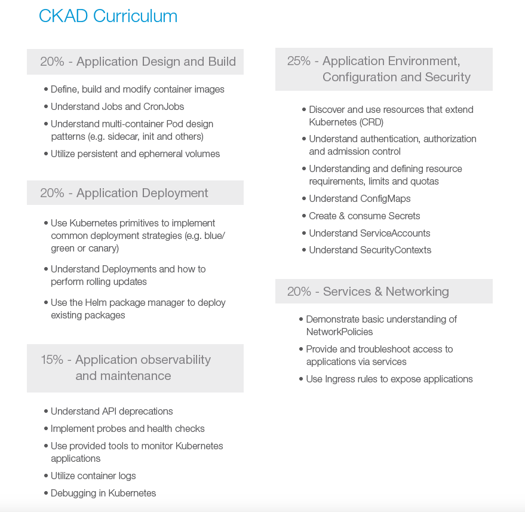

# Kubernetes labs
The following labs aim to cover the topics required to achieve CKAD certification, which requires knowledge of the following topics:


## Exercises
Each chapter ends with practical exercises for you. There is also a `SOLUTIONS.md` file with the solutions to the exercises, but before you look there, try to do it yourself. 

When solving the exercises, feel free to use the pages:
* https://kubernetes.io/docs/home/
* https://kubernetes.io/blog/
* https://helm.sh/docs/

which are also available during the official [CKAD certification](https://docs.linuxfoundation.org/tc-docs/certification/certification-resources-allowed#certified-kubernetes-administrator-cka-and-certified-kubernetes-application-developer-ckad)


## Contents
1. [Pods](Pods101/README.md)
1. [Labels and Selectors](Labels_Selectors101/README.md)
1. [Replicaset](Replicaset101/README.md)
1. [Deployment](Deployment101/README.md)
1. [Services](Services101/README.md)
1. [StatefulSets](StatefulSets101/README.md)
1. [Jobs](Jobs101/README.md)
1. [DaemonSet](DaemonSet101/README.md)
1. [Secrets and ConfigMaps](SecertsConfigmaps101/README.md)
1. [Security](Security101/README.md)
1. [Network Policies](Network_Policies101/README.md)
1. [Helm](Helm101/README.md)

## Additional learing resources
- https://www.reddit.com/r/kubernetes/ - many tips from other people preparing for CKAD exams, many practical tips, using macros to speed up solving exercises, etc.

- https://github.com/bmuschko/ckad-crash-course - practical exercises, you can find more on Github. Familiarise yourself with them, when you feel confident with the Github exercises, move on to the killercoda.

- https://killercoda.com/killer-shell-ckad - very good resource. You get free access to 2 examas when you register for the CKAD exam. If you pass the exam here, you are ready to take the CKAD, as the Killerconda examas are slightly harder. Suggested at the end of your learning path

**Additional**
- https://kubernetes.io/docs/reference/kubectl/cheatsheet/
after
```
source <(kubectl completion bash) # set up autocomplete in bash into the current shell, bash-completion package should be installed first.
echo "source <(kubectl completion bash)" >> ~/.bashrc # add autocomplete permanently to your bash shell.
```

```
kubectl get deployments.apps
```
filled automatically **deployments.apps**

After
```
# short alias to set/show context/namespace (only works for bash and bash-compatible shells, current context to be set before using kn to set namespace)
alias kx='f() { [ "$1" ] && kubectl config use-context $1 || kubectl config current-context ; } ; f'
alias kn='f() { [ "$1" ] && kubectl config set-context --current --namespace $1 || kubectl config view --minify | grep namespace | cut -d" " -f6 ; } ; f'
```
switching the name space context is faster.